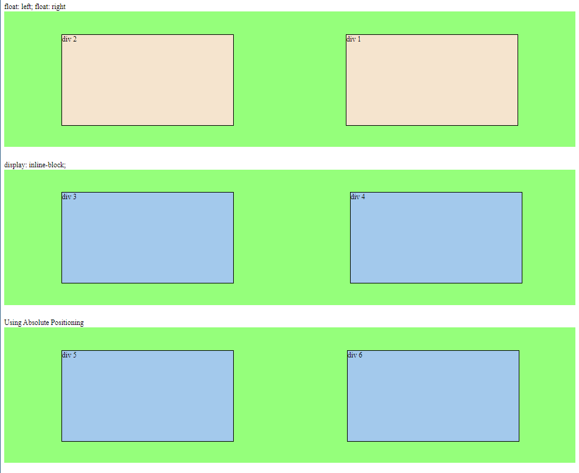
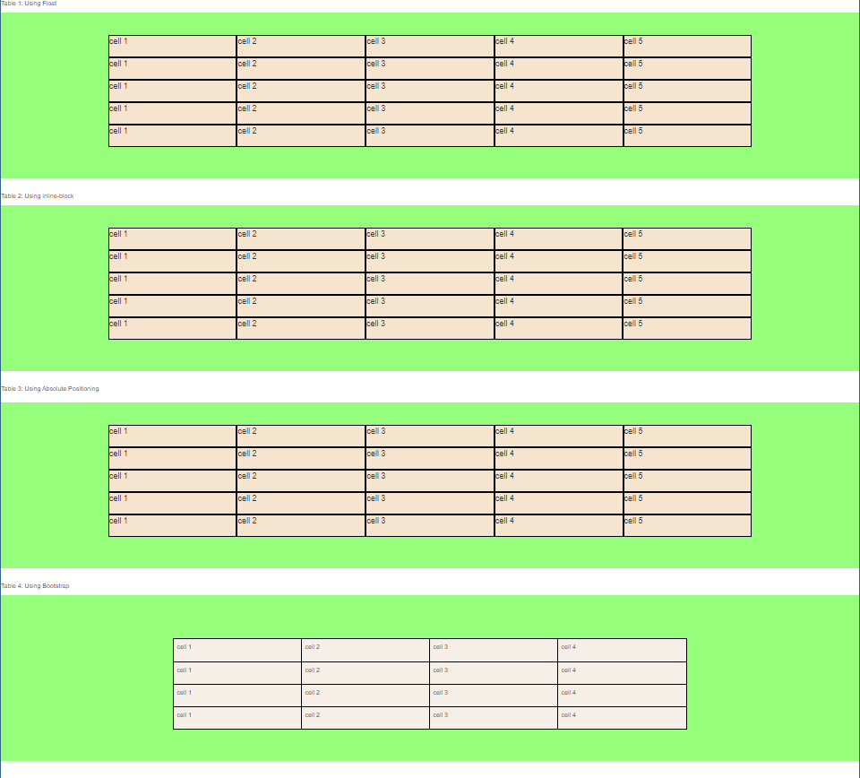

# Training-Project-1

## Div Positioning

### Code

- HTML
- CSS

### Concepts

- HTML- basic tags
- HTML/CSS - positioning div

### Objective

> Recreate the following things using div positioning.
> I would like everyone to be able to recreate both of these including positioning the labels (i.e. “float: left; float: right”)
>
> > The wrapper for each section (the green box) should not have a position attribute. Only the third green box should have position: relative;

## Part 1

 
 

## Part 2

Create the table out of divs. DO NOT USE HTML TABLES.

Use Bootstrap
https://maxcdn.bootstrapcdn.com/bootstrap/3.3.7/css/bootstrap.min.css

Table 4: Using Bootstrap
